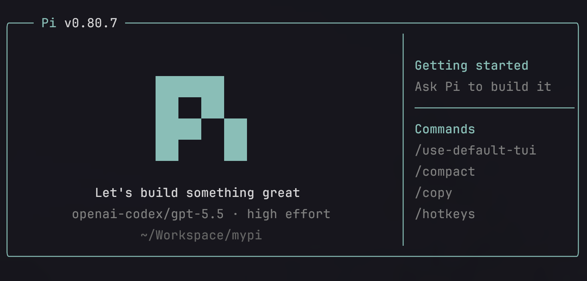

# pi-claude-code-tui

A pi package that gives startup a polished Pi header while keeping pi's original footer.



## Installation

Install from npm globally for your user:

```bash
pi install npm:pi-claude-code-tui
```

Or install it only for the current project:

```bash
pi install -l npm:pi-claude-code-tui
```

Try it for one run without installing:

```bash
pi -e npm:pi-claude-code-tui
```

## What it changes

- Header title: left-aligned `─── Pi v<pi version> ─────`
- Animated Pi logo matching the dynamic color-changing mark from `curl -fsSL https://pi.dev/install.sh | sh`, settling into the border color
- Center text: `Let's build something great!`
- Shows current model, thinking effort, and cwd
- Right-side tips panel on wide terminals
- Codex-style rounded input box
- Keeps pi's original footer and spinner

## Local development

```bash
pi -e .
```

## Commands

- `/use-claude-code-tui` — switch to this package's look (Pi header + Codex-style input)
- `/use-default-tui` — switch back to pi's built-in header, footer, editor, and spinner

## License

MIT
